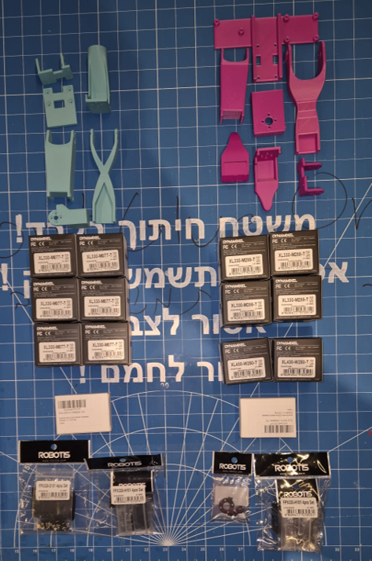
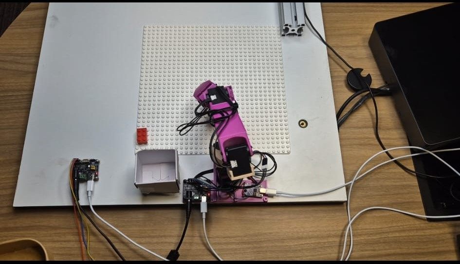
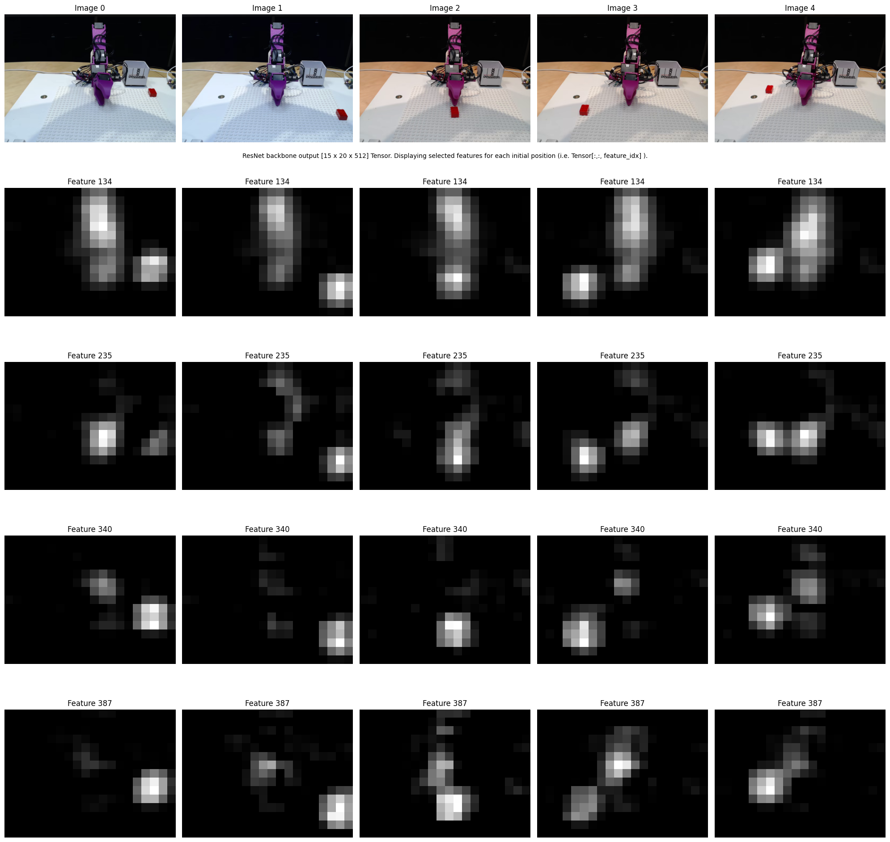

# AutonomousArm

Train a robotic arm to pick up a cube and place it in a box autonomously, and explore how the model makes decisions using mechanistic interpretability techniques.

## Project Overview

AutonomousArm is a research project focused on developing and analyzing a robotic arm controlled by a Transformer-based model. The goal is to understand not only how to achieve autonomous movement, but also how the underlying model represents and memorizes information.

## Building the Robotic Arm

We built a robotic arm using the [lerobot guide](https://huggingface.co/lerobot), which includes instructions for ordering motors and 3D printing components.

**3D printing video:**  
[Watch here](demos/3d_printing.mp4)

**All parts:**  

**Assembled arm:**  

## Collecting Data and Training the Model

We used a teleoperation setup to collect data for training the model.  
[Teleoperation video](https://drive.google.com/file/d/120DukbRjiXrmo3eBLwkWLlXfkgMk9tW1/view?usp=drive_link)

**Autonomous arm demo:**  
[Watch here](demos/autonomusArm.mp4)

## Mechanistic Interpretability Exploration

We applied mechanistic interpretability techniques to analyze how the model makes decisions. The focus was on understanding how the model encodes information about the environment and how it generalizes actions.

## Model Architecture

- **Inputs:**  
  - Top and lateral camera images ($I_{\text{top}}, I_{\text{lat}}$)
  - Arm joint angles ($q$)
- **Feature Extraction:**  
  - Images processed by ResNet to produce feature vectors.
- **Tokenization:**  
  - 600 pixel tokens (300 per camera), arm state token, and condition token.
- **Transformer Encoding:**  
  - Three encoder layers process all tokens for global information flow.
- **Action Vector Update:**  
  - Zero-initialized action vector updated via cross-attention and MLP to produce robot actions.

Reference: [ACT paper](https://arxiv.org/abs/2304.13705)

## Research Hypothesis

> The MLP layer in the decoder memorizes exact actions rather than generalizing, acting as a "lookup table" for robot movements.  
> Attention maps show only a subset of tokens receive high scores, and arm state information is absorbed by pixel tokens.

##  Validation Plan

1. **ResNet Feature Extraction:**  
   Verify that the ResNet features encode all necessary information for the model to perform actions without relying on attention layers.  
   This can be done by training a linear classifier on the ResNet features, with labels from different arm and cube positions, to see if it can predict the action vector.
2. **Probing Action Vector:**  
   Train linear classifiers to verify if the action vector encodes all relevant environmental details.
3. **Fine-tuning Only MLP Layer:**  
   Fine-tune the model on new locations by freezing all layers except the MLP to see if it can adapt to lift cubes from those locations, confirming the hypothesis of memorization.

## Results

- **ResNet Feature Extraction:**  
  The ResNet features successfully encoded the necessary information for the model to perform actions without relying on attention layers.

- Fine-tuning the MLP layer on new locations confirmed that the model can adapt to lift cubes from those locations, supporting the hypothesis of memorization.

**Video before fine-tuning:**  
[Watch here](https://drive.google.com/file/d/17qZyIfk2H-mmMDLNL7dcJMz9CDVp_HZy/view?usp=drive_link)

**Video after fine-tuning:**  
[Watch here](https://drive.google.com/file/d/17rGYhNp-gshNCPEEz9eS0hpmRujP4OzZ/view?usp=drive_link)
